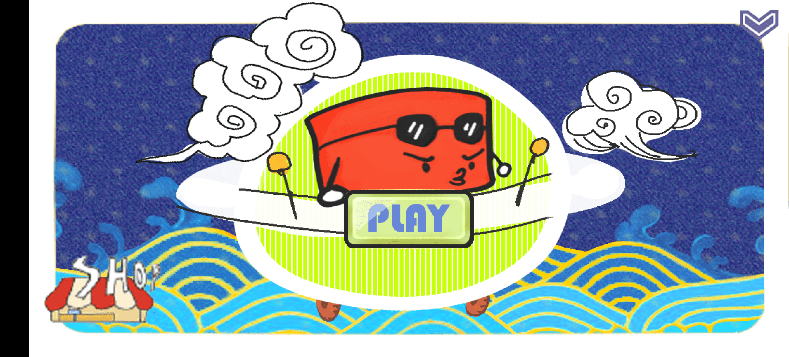
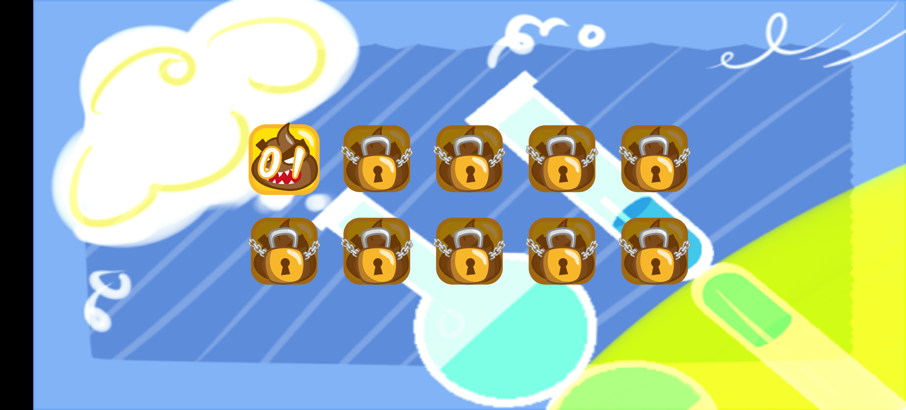
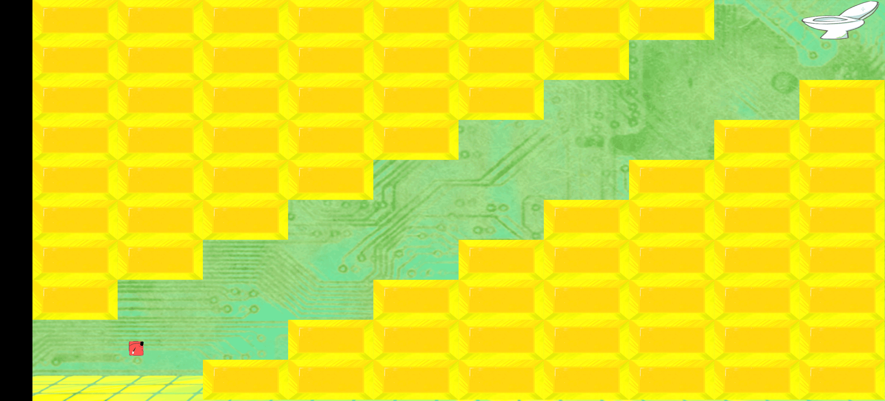

# hufflepuffpig

 

##   鬼马方块 

[**Download From Google Play**](https://play.google.com/store/apps/details?id=com.hopelin.funnysquare)

> Silly Cube's spaceship broke down during the trip and fell to the poop planet. Come and help Cube Boy avoid the enemies, find the key to the maze, and find the exit of the maze!
>
> - Click to skip the plot manga
> - Swipe left and right to select the level (the premise is to break through the maze)
> - The upper left, upper right, lower left, and lower right screen areas control the actions of the cube boy
> - Use props flexibly (acceleration, deceleration, shield) to help pass the level

|||
|--|--|
|||

**Have a Try**
https://play.google.com/store/apps/details?id=com.hopelin.funnysquare